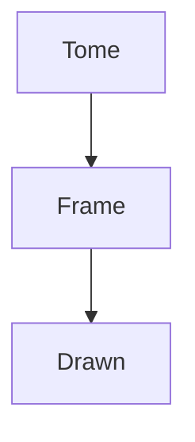

# A diagram that reaches out

Its `%%{init}%%` block tries to set styles and fonts that load from another site (docs/LIBRARY.md, "Read the Tomes").

```mermaid
%%{init: {"themeCSS": "@import url('__ELSEWHERE__/diagram/import.css'); @font-face { font-family: Elsewhere; src: url('__ELSEWHERE__/diagram/font.woff2'); } .node rect { fill: url('__ELSEWHERE__/diagram/fill.svg#x'); } svg { background: url('__ELSEWHERE__/diagram/background.png'); }", "fontFamily": "Elsewhere; } svg { background-image: url('__ELSEWHERE__/diagram/font-family.png'); } .x {", "themeVariables": {"fontFamily": "Elsewhere, url('__ELSEWHERE__/diagram/theme-font.png')"}}}%%
flowchart TD
  Tome --> Frame
  Frame --> Drawn
```
